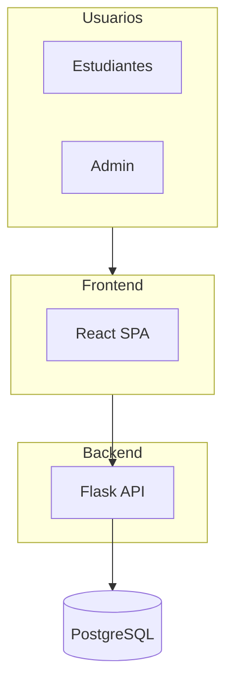

# Referencia: Document Word Enhancement

## Office Word MCP Server (recomendado)

**URL:** [mcpmarket.com/es/server/office-word](https://mcpmarket.com/es/server/office-word)

**Repositorio:** [github.com/GongRzhe/Office-Word-MCP-Server](https://github.com/GongRzhe/Office-Word-MCP-Server)

### Capacidades

- Crear documentos Word con metadatos
- Añadir encabezados, párrafos, tablas, imágenes
- Formatear texto (negrita, cursiva, color, fuente)
- Buscar y reemplazar
- Extraer texto y estructura del documento
- Convertir a PDF
- Protección con contraseña, firmas digitales
- Extraer comentarios

### Configuración en Cursor

**Opción 1: Sin instalación (uvx)** – requiere [uv](https://docs.astral.sh/uv/):

```json
{
  "mcpServers": {
    "word-document-server": {
      "command": "uvx",
      "args": ["--from", "office-word-mcp-server", "word_mcp_server"]
    }
  }
}
```

**Opción 2: Instalación local**

```bash
git clone https://github.com/GongRzhe/Office-Word-MCP-Server.git
cd Office-Word-MCP-Server
pip install -r requirements.txt
```

Luego en la configuración MCP de Cursor:

```json
{
  "mcpServers": {
    "word-document-server": {
      "command": "python",
      "args": ["/ruta/completa/a/word_mcp_server.py"]
    }
  }
}
```

**Opción 3: Smithery (Claude Desktop)**

```bash
npx -y @smithery/cli install @GongRzhe/Office-Word-MCP-Server --client claude
```

### Herramientas principales

| Herramienta | Uso |
|-------------|-----|
| `create_document` | Crear documento nuevo |
| `add_heading`, `add_paragraph` | Insertar contenido |
| `add_table`, `add_picture` | Tablas e imágenes |
| `format_text`, `format_table` | Formatear |
| `get_document_text`, `get_document_info` | Extraer contenido |
| `search_and_replace` | Buscar y reemplazar |
| `convert_to_pdf` | Exportar a PDF |

## Otros MCP Servers

| Servidor | Capacidades |
|----------|-------------|
| **Document-Edit-MCP** | Word, Excel, PDF |
| **Aspose.Words** | Avanzado (licencia comercial) |
| **doc-tools-mcp** | `npx @puchunjie/doc-tools-mcp` |

## Librerías Python

| Librería | Uso |
|----------|-----|
| `python-docx` | Crear y editar .docx (texto, imágenes, tablas) |
| `Pillow` (PIL) | Recortar, redimensionar, convertir imágenes |
| `zipfile` (stdlib) | Extraer .docx (ZIP) para leer XML e imágenes |
| `matplotlib` | Gráficas de datos (barras, líneas, etc.) |

## Código Mermaid para diagramas de arquitectura



Exportar en [mermaid.live](https://mermaid.live) como PNG/SVG.

## Estructura interna de un .docx

```
documento.docx (ZIP)
├── word/
│   ├── document.xml    # Contenido principal (texto, referencias)
│   ├── media/          # Imágenes (image1.jpeg, image2.png, ...)
│   ├── styles.xml
│   └── ...
├── [Content_Types].xml
└── _rels/
```

## Namespace XML para extraer texto

```python
NS = "{http://schemas.openxmlformats.org/wordprocessingml/2006/main}"
for t in root.iter(f"{NS}t"):
    # t.text contiene el texto
```
