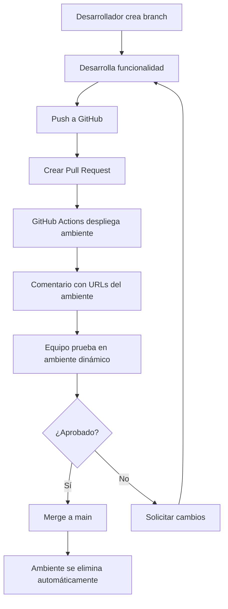

# 👥 **Flujo de Trabajo Colaborativo - Guía para el Equipo**

## 🎯 **Cómo Trabajar con Ambientes Dinámicos**

### **📋 Para Desarrolladores**

#### **1. Crear una Nueva Feature:**
```bash
# 1. Crear branch desde main
git checkout main
git pull origin main
git checkout -b feature/nueva-funcionalidad

# 2. Hacer cambios en el código
# ... desarrollar ...

# 3. Commit y push
git add .
git commit -m "feat: agregar nueva funcionalidad"
git push origin feature/nueva-funcionalidad

# 4. Crear Pull Request en GitHub
# GitHub Actions creará automáticamente el ambiente dinámico
```

#### **2. Trabajar en el Ambiente Dinámico:**
- ✅ **Frontend**: Se despliega automáticamente en CloudFront
- ✅ **Backend**: Se despliega automáticamente en Lambda
- ✅ **Base de datos**: Usa la base de datos compartida (solo lectura para PRs)
- ✅ **URLs**: Se muestran en el comentario del PR

#### **3. Probar Cambios:**
```bash
# Probar endpoints del ambiente dinámico
curl https://abc123.execute-api.us-east-1.amazonaws.com/dev/api/health

# Ver logs en tiempo real
aws logs tail /aws/lambda/elearning-backend-pr-123-dev-app --follow

# Probar frontend
# Abrir la URL del CloudFront en el navegador
```

#### **4. Colaborar con el Equipo:**
- 📝 **Comentar en el PR** con feedback sobre el ambiente
- 🔗 **Compartir URLs** del ambiente para revisión
- 🐛 **Reportar bugs** directamente en el PR
- ✅ **Aprobar cambios** cuando estén listos

### **📋 Para Revisores**

#### **1. Revisar Pull Request:**
1. **Recibir notificación** del PR con ambiente dinámico
2. **Abrir URLs** del ambiente en el comentario del PR
3. **Probar funcionalidad** en el ambiente dinámico
4. **Dejar comentarios** con feedback específico
5. **Aprobar o solicitar cambios**

#### **2. URLs del Ambiente:**
Cada PR tendrá un comentario automático con:
```
🚀 Ambiente Dinámico Desplegado

Frontend: https://d1234567890.cloudfront.net
Backend API: https://abc123.execute-api.us-east-1.amazonaws.com/dev
Database: Ambiente temporal creado

Comandos útiles:
curl https://abc123.execute-api.us-east-1.amazonaws.com/dev/api/health
```

### **📋 Para Administradores**

#### **1. Monitorear Ambientes:**
```bash
# Ver todos los ambientes activos
aws cloudformation list-stacks --stack-status-filter CREATE_COMPLETE UPDATE_COMPLETE | grep "pr-"

# Ver costos por ambiente
aws ce get-cost-and-usage --time-period Start=2024-01-01,End=2024-01-31

# Limpiar ambiente manualmente (si es necesario)
./scripts/cleanup-dynamic-environment.sh 123
```

#### **2. Configurar Notificaciones:**
- 📧 **Email**: Configurar notificaciones en GitHub
- 💬 **Slack**: Agregar webhook en secretos
- 🔔 **Discord**: Agregar webhook en secretos

## 🔄 **Flujo Completo de Desarrollo**

### **Escenario: Agregar Nueva Funcionalidad**



### **Beneficios del Flujo:**

1. **🚀 Desarrollo Rápido**: Ambiente listo en 5-10 minutos
2. **🔒 Aislamiento**: Cada PR tiene su propio ambiente
3. **💰 Control de Costos**: Ambientes se eliminan automáticamente
4. **👥 Colaboración**: Equipo puede probar cambios fácilmente
5. **🔄 Automatización**: Sin intervención manual

## 🛠️ **Comandos Útiles para el Equipo**

### **Para Desarrolladores:**
```bash
# Ver logs del ambiente actual
aws logs tail /aws/lambda/elearning-backend-pr-$(git branch --show-current | grep -o '[0-9]\+')-dev-app --follow

# Probar endpoint específico
curl -X POST https://abc123.execute-api.us-east-1.amazonaws.com/dev/api/endpoint \
  -H "Content-Type: application/json" \
  -d '{"test": "data"}'

# Ver estado del ambiente
aws cloudformation describe-stacks --stack-name elearning-backend-pr-123-dev
```

### **Para QA/Testing:**
```bash
# Ejecutar tests en el ambiente dinámico
npm run test -- --baseURL=https://abc123.execute-api.us-east-1.amazonaws.com/dev

# Verificar salud del ambiente
curl https://abc123.execute-api.us-east-1.amazonaws.com/dev/api/health

# Probar carga
ab -n 100 -c 10 https://abc123.execute-api.us-east-1.amazonaws.com/dev/api/health
```

## 📊 **Monitoreo y Métricas**

### **Métricas Importantes:**
- ⏱️ **Tiempo de despliegue**: ~5-10 minutos por ambiente
- 💰 **Costo por PR**: ~$0.50-2.00 USD por día
- 🔄 **Tasa de éxito**: >95% de despliegues exitosos
- 🧹 **Limpieza automática**: 100% de recursos eliminados

### **Alertas Configuradas:**
- 🚨 **Fallos de despliegue**: Notificación inmediata
- 💰 **Costos altos**: Alerta si un ambiente supera $5/día
- ⏰ **Ambientes antiguos**: Alerta si un PR está abierto >7 días

## 🎯 **Mejores Prácticas**

### **Para Desarrolladores:**
1. **✅ Nombres descriptivos** para branches: `feature/user-authentication`
2. **✅ Commits pequeños** y frecuentes
3. **✅ Describir cambios** en el PR
4. **✅ Probar en ambiente dinámico** antes de solicitar review
5. **✅ Cerrar PRs** cuando no se necesiten

### **Para Revisores:**
1. **✅ Probar en ambiente dinámico** antes de aprobar
2. **✅ Dejar feedback específico** y constructivo
3. **✅ Aprobar rápidamente** si los cambios son buenos
4. **✅ Solicitar cambios** si hay problemas

### **Para Administradores:**
1. **✅ Monitorear costos** semanalmente
2. **✅ Revisar logs** de GitHub Actions
3. **✅ Mantener secretos** actualizados
4. **✅ Documentar cambios** en la configuración

## 🚨 **Troubleshooting Común**

### **Problema: Ambiente no se despliega**
```bash
# Verificar logs de GitHub Actions
# Revisar que los secretos estén configurados
# Confirmar permisos de AWS
```

### **Problema: Ambiente no se elimina**
```bash
# Limpiar manualmente
./scripts/cleanup-dynamic-environment.sh 123

# Verificar que el PR esté cerrado
# Revisar logs de GitHub Actions
```

### **Problema: URLs no funcionan**
```bash
# Verificar que CloudFront esté desplegado
aws cloudfront get-distribution --id DISTRIBUTION_ID

# Verificar que S3 esté configurado
aws s3api head-bucket --bucket BUCKET_NAME
```

## 🎉 **¡Listo para Colaborar!**

Con esta configuración, tu equipo puede:
- ✅ **Desarrollar en paralelo** sin conflictos
- ✅ **Probar cambios** en ambientes aislados
- ✅ **Colaborar eficientemente** con URLs compartidas
- ✅ **Controlar costos** con limpieza automática
- ✅ **Escalar el equipo** sin problemas de infraestructura

**¡Disfruta del desarrollo colaborativo!** 🚀
