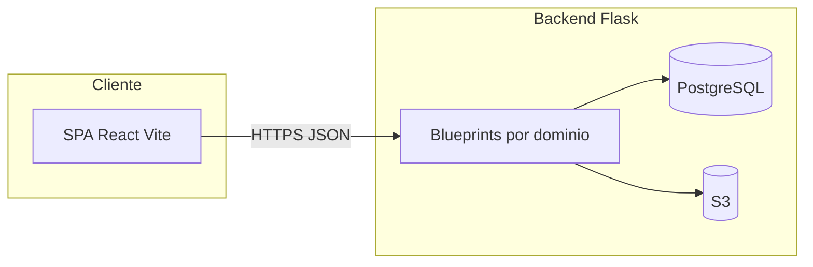

# Librerías y número de APIs en el proyecto

Documento generado a partir del inventario del código fuente. Última verificación: conteo de decoradores `@*.route` en `backend/backend-app/src`.

## Alcance

- **Aplicativo**: **frontend** ([frontend/frontend-app/package.json](../frontend/frontend-app/package.json)) + **backend API** ([backend/backend-app/requirements.txt](../backend/backend-app/requirements.txt) y [backend/backend-app/src](../backend/backend-app/src)).
- **APIs**: cada **ruta HTTP** registrada con `@app.route` o `@*_bp.route` en `src`. Si hay dos `@route` al mismo path, cuentan como dos definiciones en código (Flask solo aplica la última registrada para ese path).

---

## Librerías frontend (React / Vite)

**Runtime y build**: `react`, `react-dom`, `react-router-dom`, `vite`, plugins `@vitejs/plugin-react`, `@vitejs/plugin-legacy`, `eslint` + plugins, `terser`.

**Estilos y UI**: `tailwindcss`, `@tailwindcss/vite`, `tailwind-merge`, `class-variance-authority`, `clsx`, `tw-animate-css`; ecosistema **Radix UI** (`@radix-ui/react-*`: accordion, dialog, dropdown, tabs, etc.).

**Formularios y validación**: `react-hook-form`, `@hookform/resolvers`, `zod`, `input-otp`.

**Datos / utilidades**: `date-fns`, `xlsx`, `jszip`, `file-saver`, `recharts`, `embla-carousel-react`, `cmdk`, `vaul`, `next-themes`.

**UX / animación / feedback**: `framer-motion`, `sonner`, `lucide-react` (iconos).

**Email cliente**: `@emailjs/browser`.

**Otros**: `react-resizable-panels`, `react-day-picker`.

En `package.json` hay **53 dependencias de producción** (`dependencies`) y **12 de desarrollo** (`devDependencies`).

---

## Librerías backend (Python / Flask)

Según [requirements.txt](../backend/backend-app/requirements.txt):

| Paquete | Uso típico |
|--------|------------|
| `Flask`, `Werkzeug`, `Jinja2`, `MarkupSafe`, `itsdangerous`, `click`, `blinker` | Web framework y dependencias |
| `flask-cors` | CORS |
| `Flask-SQLAlchemy`, `SQLAlchemy`, `greenlet` | ORM y capa DB |
| `psycopg[binary]` | Driver PostgreSQL |
| `python-dotenv` | Variables de entorno |
| `boto3` | AWS (S3, etc.) |
| `PyJWT` | JWT |
| `serverless-wsgi` | Adaptador Lambda |
| `openpyxl`, `pandas` | Excel / datos tabulares |
| `pypdf` | PDF |
| `typing_extensions` | Tipado |

**21** paquetes listados con versión en ese archivo (algunas entradas son dependencias del stack Flask listadas de forma explícita).

---

## Número de APIs (endpoints)

Conteo de `@app.route(` o `@*_bp.route(` en `backend/backend-app/src`:

| Archivo | Rutas |
|--------|-------|
| [main.py](../backend/backend-app/src/main.py) | 1 (`/api/health`) |
| [student.py](../backend/backend-app/src/routes/student.py) | 22 |
| [instructor.py](../backend/backend-app/src/routes/instructor.py) | 28 |
| [user.py](../backend/backend-app/src/routes/user.py) | 27 |
| [admin.py](../backend/backend-app/src/routes/admin.py) | 39 |
| [forum.py](../backend/backend-app/src/routes/forum.py) | 13 |
| [support.py](../backend/backend-app/src/routes/support.py) | 6 |
| [user_files.py](../backend/backend-app/src/routes/user_files.py) | 1 |
| [file_upload.py](../backend/backend-app/src/routes/file_upload.py) | 5 |
| [db_query.py](../backend/backend-app/src/routes/db_query.py) | 1 |
| [evidencias.py](../backend/backend-app/src/routes/evidencias.py) | 7 |
| [config_admin.py](../backend/backend-app/src/routes/config_admin.py) | 14 |
| [activos.py](../backend/backend-app/src/routes/activos.py) | 9 |
| [evaluaciones.py](../backend/backend-app/src/routes/evaluaciones.py) | 11 |
| [criterios.py](../backend/backend-app/src/routes/criterios.py) | 7 |
| [cursos.py](../backend/backend-app/src/routes/cursos.py) | 8 |
| [notificaciones.py](../backend/backend-app/src/routes/notificaciones.py) | 3 |
| [resources.py](../backend/backend-app/src/routes/resources.py) | 8 |
| [content.py](../backend/backend-app/src/routes/content.py) | 12 |
| [db_migration.py](../backend/backend-app/src/routes/db_migration.py) | 5 |

**Total: 227** definiciones de ruta en código.

**Matiz**: en `admin.py` hay dos `@admin_bp.route('/users', methods=['GET'])` con funciones distintas; en ejecución solo una queda activa (la última registrada). Las **URLs únicas** operativas pueden contarse como **226** si se excluye ese duplicado.

Los prefijos HTTP reales combinan cada blueprint con `url_prefix` en [main.py](../backend/backend-app/src/main.py) (por ejemplo `/api`, `/api/admin`, `/api/instructor`, `/api/student`, `/api/files`, `/api/migration`, etc.).



---

## Resumen

1. **Librerías**: **React 19 + Vite 6 + Tailwind 4 + Radix + react-hook-form + zod** en el cliente; **Flask + SQLAlchemy + psycopg + boto3 + JWT + serverless-wsgi** en el servidor, más **pandas / openpyxl / pypdf** para exportaciones y documentos.
2. **APIs**: **227** endpoints definidos en el código del backend; **226** rutas únicas si no se cuenta el `GET /api/admin/users` duplicado en implementación.

### Cómo reproducir el conteo

Desde la raíz del repositorio (con ripgrep):

```bash
rg -c '@(\w+_bp|app)\.route\(' backend/backend-app/src
```

Sumar los totales por archivo (incluir `db_migration.py` con `@migration_bp.route`).
